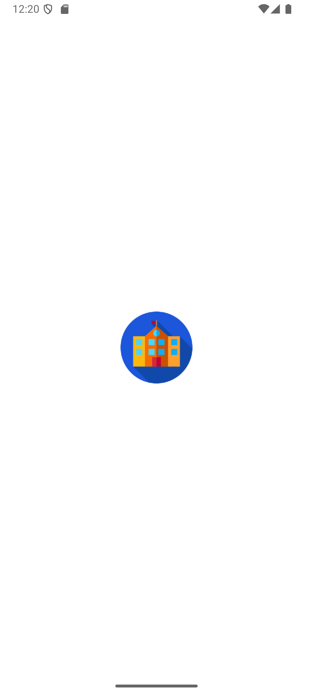
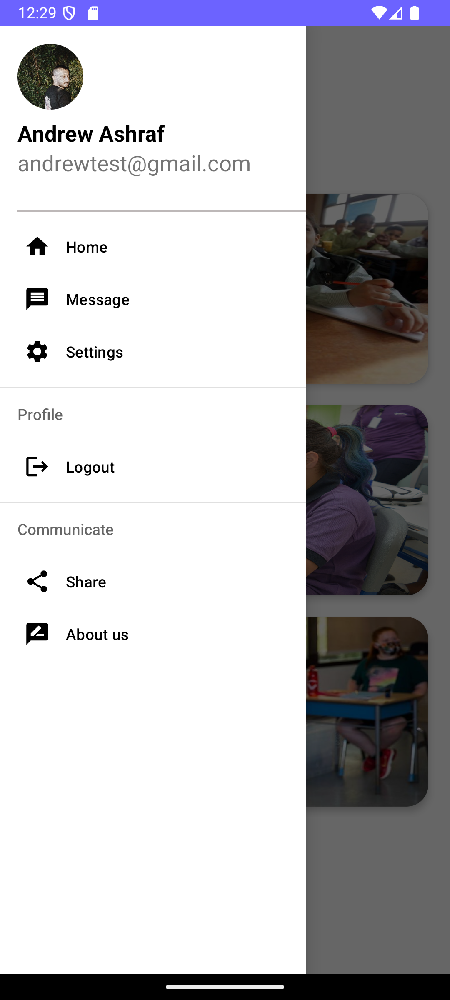

# School Guide

**Smart School Selection & Admission Made Simple**

School Guide is a mobile Android application developed as a graduation project. It helps users search for, compare, and apply to schools based on location, education system, tuition fees, and reviews.

> 🚫 This project is for academic purposes only and is not licensed for public or commercial use.

## Features

- 🔍 Search and filter schools
- 📊 Compare schools by criteria
- 📝 Apply to schools directly from the app
- ⭐ View and submit reviews
- 📍 Map integration for school locations

## Screenshots

  
  
  
  

  
  
  
  

  
  
  
  

## 🎥 Demo

▶️ [Click here to watch the demo](screenshots/Demo.mp4)

## Technologies Used

- **Languages:** Kotlin, Java  
- **Platform:** Android Studio  
- **Backend:** Firebase (Authentication, Realtime Database / Firestore)

## How to Run

1. Clone this repository
2. Open the project in Android Studio
3. Connect your own Firebase project
4. Build and run the app on an emulator or device

## License

This project is **not open source**.  
All rights reserved © 2025 Andrew Ashraf.  
Do not use, distribute, or modify this code without permission.
